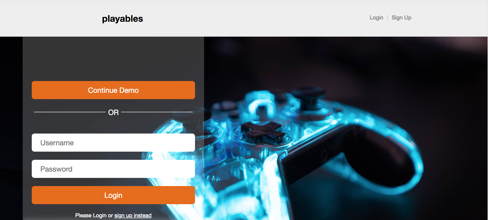
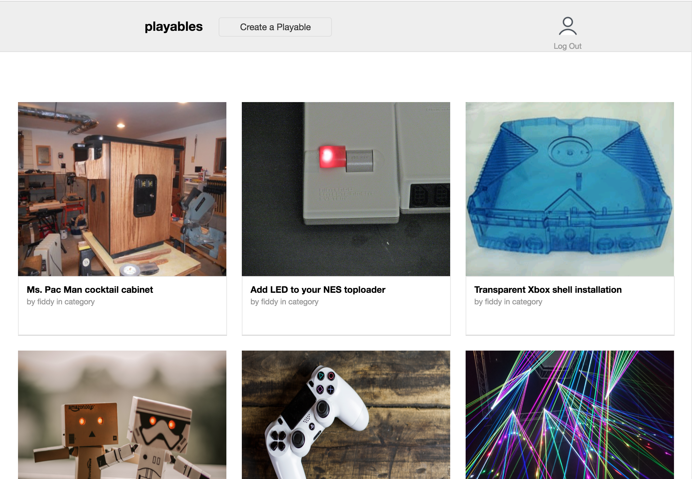
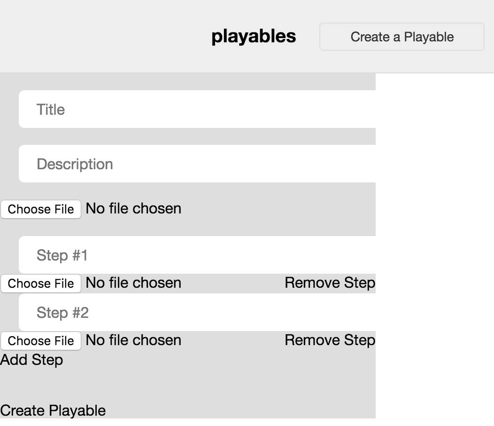

# Playables

[Live Demo][heroku]

[heroku]: https://playables.herokuapp.com/#/

Playables is inspired by the DIY site Instructables. The focus is on modifications or “how-tos” for video game consoles, peripherals, and arcade cabinets. It uses Rails/PostgreSQL backend with React.js and Redux on the frontend.

The project was designed and built under two-weeks. It is a work in progress

## Features
  * Handle images with Active Storage Amazon service.
  * Users can create Projects using a dynamic form.
  * Secure frontend to backend user authentication using BCrypt.
  * Project index shows all projects currently sorted by oldest.


### Login



A user can sign up or log in. There is also an option to log in a a demo user to allow for a user to experiment with creating a project.

### Project Index



The Project Index displays the hero image for the project, along with the username of the user who created it. There is a placeholder for a category which will be implemented in a future version. If a user is logged in, they may create a project. A user is not prohibited from viewing the Project Index.


### Project Create Form

```jsx
  handleStepChange = (idx) => (e) => {
  const newStep = this.state.steps.map((step, sidx) => {
    if (idx !== sidx) return step;
    return { ...step, body: e.target.value};
  });
    this.setState({ steps: newStep });
  }
```

The main breakthrough for the form was being able to add, remove, or update the steps such that they would be prepared in the state for saving when handling the submission of the form.


## Project Design

Although the project is relatively simple, my focus was on fixing bugs as I encountered them and truly understanding each line that was written. While not all MVPs are functional, I wrote an extensive amount of code that has not yet been implemented in anticipation of future features’ implementation.

## Technologies

Rails is amazing for managing relational information and ease of database manipulation/access. Speed is desirable due to the heavy load of images on the index page. Heroku is an excellent host for this type of project.

The state is maintained by a Frontend Redux utilization of reducers and actions for entities (users, steps, projects), session, and errors.

## Next steps

  * Saving steps to a project
  * Project show page
  * Categories
  * Search
  * Comments
